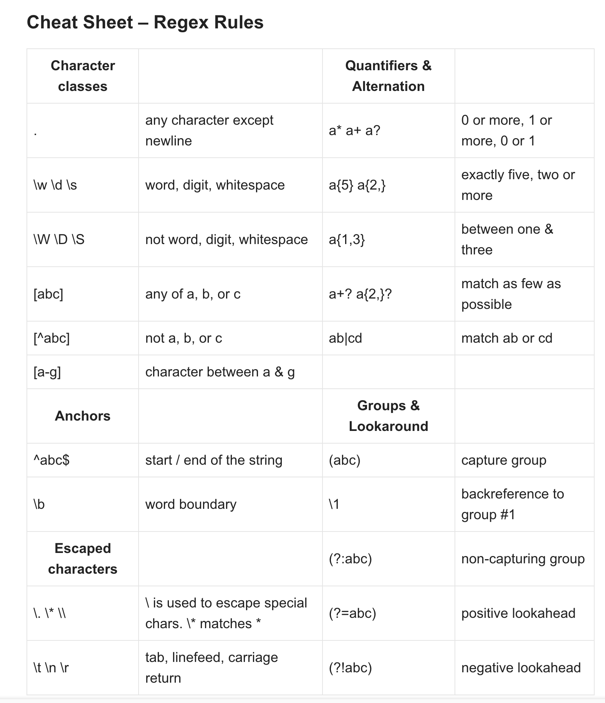

# Regular-Expressions-Tutorial-

## What are Regex?

Regular expression are patterns used to match character combinations in string. In JavaScript, regular expressions are also objects. These patterns are used with the exec and test methods of RegExp, along with the match, replace, search, and split methods of String.

## Summary
Demo an example for URL Regular Expressions
```
https?:\/\/(www\.)?[-a-zA-Z0-9@:%._\+~#=]{2,256}\.[a-z]{2,6}\b([-a-zA-Z0-9@:%_\+.~#()?&//=]*)
```
## Table of Contents

- [Anchors](#anchors)
- [Quantifiers](#quantifiers)
- [OR Operator](#or-operator)
- [Character Classes](#character-classes)
- [Flags](#flags)
- [Grouping and Capturing](#grouping-and-capturing)
- [Bracket Expressions](#bracket-expressions)
- [Greedy and Lazy Match](#greedy-and-lazy-match)
- [Boundaries](#boundaries)
- [Back-references](#back-references)
- [Look-ahead and Look-behind](#look-ahead-and-look-behind)

## Regex Components

Regular expressions are objects that represent patterns in strings. They use their own language to express these patterns.



### Anchors
```
regular expression anchors -- match a position before or after characters. Anchors have special meaning in regular expressions. They do not match any character. Instead, they match a position before or after characters:
```
- `/^/`	anchor to match the beginning of the text.
- `/$/`	anchor to match the end of the text.
- To enable the multiline mode, you use `/m/` flag. In the multiline mode, the `/^/` or `/$/` anchor matches the beginning or end of the string as well as the beginning or end of lines.

### Quantifiers
- `/^\d+$/` Whole numbers
- `/^\d*.\d+$/` Decimal numbers
- `/^\d*(.\d+)?$/` Whole numbers and decimal numbers
- `/^-?\d*(.\d+)?$/` Negative, positive whole numbers & decimal numbers
```
  Quantifier	Description
  *	          Match zero or more times.
  +	          Match one or more times.
  ?	          Match zero or one time.
{ n }	        Match exactly n times.
{ n ,}	      Match at least n times.
{ n , m }	    Match from n to m times.
```
### OR Operator
- Regex uses the pipe operator `|` to represent an alternation, which is like the logical OR operator in regular expressions. 
- Use parentheses () to wrap the parts that you want to apply the alternation.


### Character Classes

- `/\d/`	Any digit character
- `/\w/`	An alphanumeric character (“word character”)It matches the ASCII character `[A-Za-z0-9_]` including Latin alphabets, digits, and the underscore `(_)`
- `/\s/`	Any whitespace character
- `/./`	Any character except newlines
- `/\b/`	A word boundary

### Flags

- The ignore flag `(i)`, `i` stands for ignore.
- The global flag `(g)`. Without the global flag, the RegExp object only checks if there is a match in a string and returns the first match.

### Grouping and Capturing

- Place a rule in parentheses `()` to create a capturing group. A regular expression can have multiple capturing groups.
- Use the `(?<capturingGroupName>rule)` to create a named capturing group for the rule in a pattern.

### Bracket Expressions

- `[abcd]`             Matches any character in the square brackets.
- `[a-d]`               Matches any character in the range of characters separated by a hyphen `(-)`.
- `[^abcd] or [^a-d]`   Matches any character except those in the square brackets or in the range of characters separated by a hyphen `(-)`.
- `[.ab.]`              Matches a multi-character collating element.
-`[=a=]`               Matches all collating elements with the same primary sort order as that element, including the element itself.


### Greedy and Lazy Match
```
Greedy: Keep searching until condition is not satisfied.
        Quantifiers use the greedy mode by default.
        Greedy quantifiers match their preceding elements as much as possible.
Lazy: Stop searching once condition is satisfied.
      Lazy quantifiers match their preceding elements as few as possible to return the smallest possible matches.
      Use a question mark (?) to transform a greedy quantifier into a lazy quantifier.
```

### Boundaries
- A word boundary `\b` is a test, similiar with `^` and `$`.

- When the regex engine (program module that implements searching for regexps) comes across `\b`, it checks that the position in the string is a word boundary.
- Three different positions that qualify as word boundaries: At string start, if the first string character is a word character `\w`. Between two characters in the string, where one is a word character `\w` and the other is not. At string end, if the last string character is a word character `\w`.
### Back-references

### Look-ahead and Look-behind

## Author
```
Currently I am an MSc candidate in Computer Science with Artificial
Intelligence at the University of York in the United Kingdom. In addition, I am studying Full
Stack Web Development at the UC Berkeley Extension School. I have worked at the $30B electric
car company NIO and LG in various functions such as intern and marketing. A few years ago, I
moved to the United States to pursue new opportunities and improve my English and Spanish
skills. After moving to Silicon Valley and meeting many brilliant people here, I decided that I
want to pursue a career as a software engineer. I have always enjoyed math and loved learning
about future technologies. I believe this is the best path for my skills and interests.
```

- :octocat: [Kaihuan Huang](https://github.com/kaihuan-huang)<br />
- 📧:  <a href="mailto:huangkaihuan0216@gmail.com">huangkaihuan0216@gmail.com</a>
- source: https://digitalfortress.tech/tips/top-15-commonly-used-regex/